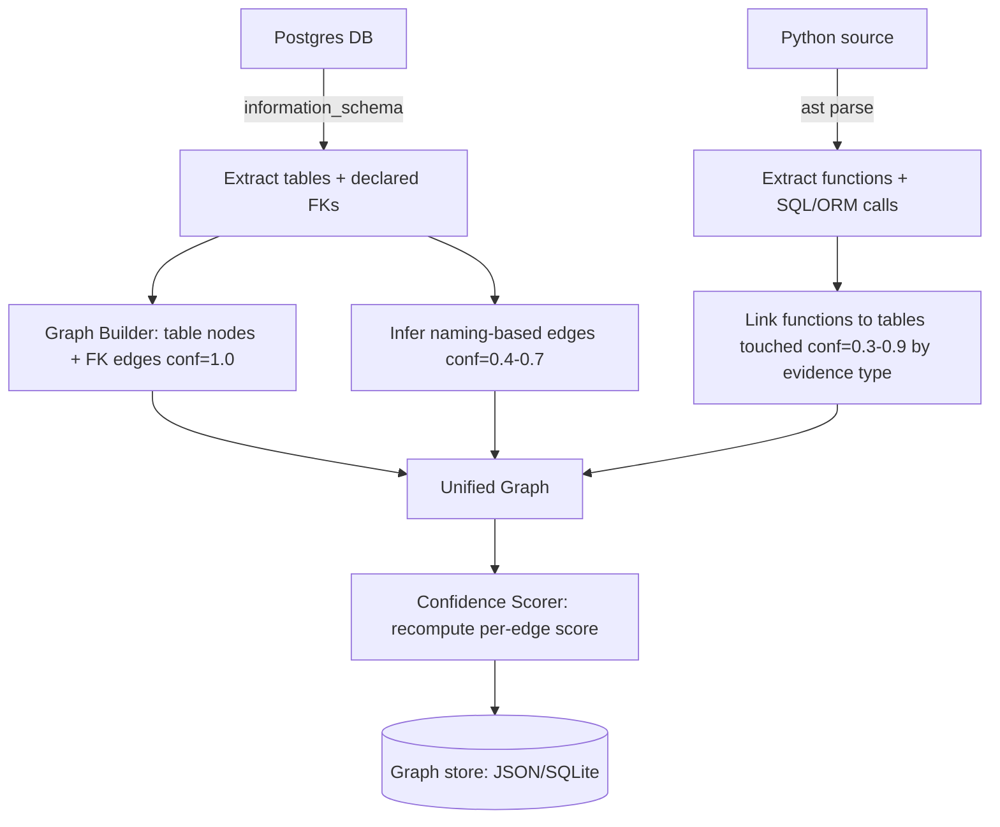
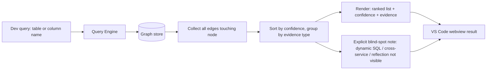
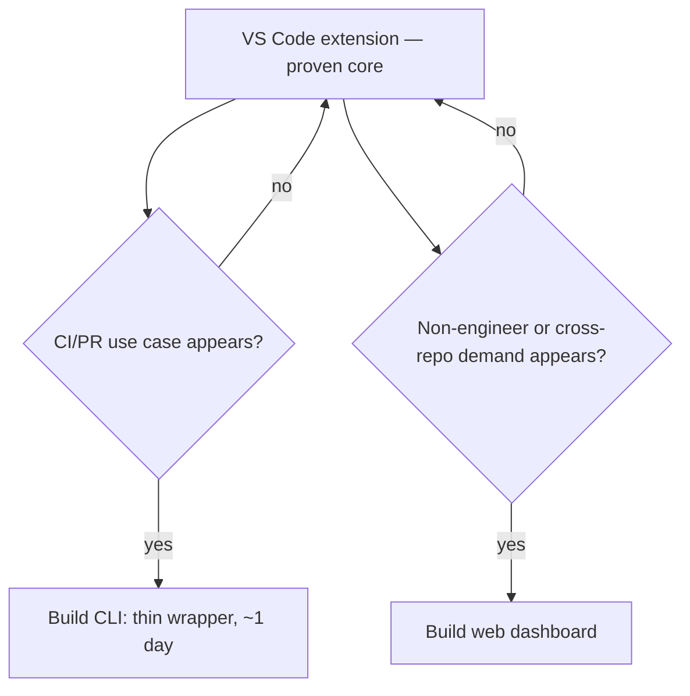

# SystemLens — Flow

## Build-time pipeline (run once per scan)

## Query-time flow (what happens when a dev asks "what touches this table?")

## Why the blind-spot step is not optional
This is the direct answer to the false-negative risk: the tool never returns "5 things affected" as if that's complete. It returns "5 things affected (here's why, here's confidence), and here's what I structurally cannot see." A dev who reads the second half won't blindly ship on an incomplete list — that's the actual product safety mechanism, not a UI nicety.

## Trigger conditions for later surfaces (from plan.md backlog)

